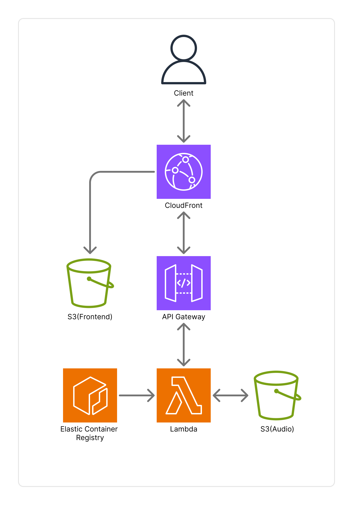

# Pedalboard Demo

ギターエフェクターをシミュレートする Web アプリケーション。

## 概要

ブラウザ上でギターエフェクターを並べ替え、音声ファイルにエフェクトを適用できるデモアプリです。

## エフェクト一覧

| カテゴリ | エフェクト |
|----------|------------|
| 歪み系 | Booster, Blues Driver, OverDrive, Distortion, Fuzz, Metal Zone, Heavy Metal |
| モジュレーション系 | Chorus, Dimension, Vibrato |
| 空間系 | Delay |

## 技術スタック

### フロントエンド (client/)
- **React** - UI フレームワーク
- **TypeScript** - 型安全
- **Vite** - ビルドツール
- **Vitest** - ユニットテスト
- **Playwright** - E2E テスト
- **Biome** - Linter/Formatter
- **wavesurfer.js** - 波形表示
- **dnd-kit** - ドラッグ&ドロップ

### バックエンド (backend/)
- **FastAPI** - Web フレームワーク
- **Pedalboard** - Spotify の音声処理ライブラリ
- **pytest** - テストフレームワーク
- **ruff** - Linter/Formatter
- **pyright** - 型チェッカー
- **pip-audit** - 脆弱性チェック

### CI/CD
- **GitHub Actions** - 自動テスト・静的解析

### 保守
- **Renovate** - 依存関係の自動更新

## AWS アーキテクチャ

- **CloudFront** - 統一エントリーポイント
  - `/*` → S3 (Frontend) へルーティング
  - `/api/*` → API Gateway へルーティング
- **S3 (Frontend)** - 静的ファイルホスティング
  - OAC (Origin Access Control) で CloudFront からのみアクセス可能
- **API Gateway (HTTP API)** - REST API エンドポイント
  - Lambda へのプロキシ統合
- **Lambda (arm64)** - バックエンド処理
  - ECR コンテナイメージ
  - FastAPI アプリケーション
- **S3 (Audio)** - 音声ファイルストレージ
  - `input/` - アップロードされた入力ファイル
  - `output/` - エフェクト適用後の出力ファイル
  - `output/normalized/` - 波形表示用の正規化ファイル
  - ライフサイクルルール: 7日で自動削除
- **ECR** - Lambda 用コンテナレジストリ
- **CloudWatch Logs** - ログ管理
  - `/aws/lambda/...` - Lambda ログ
  - `/aws/apigateway/...` - API Gateway ログ

### インフラ管理

- `infra/` - Terraform による IaC
- `scripts/deploy.sh` - デプロイスクリプト

## プロジェクト構成

- **client/** - React + TypeScript + Vite
  - エフェクターボードの UI
  - ドラッグ&ドロップでエフェクトの並び替え
  - 波形表示 (wavesurfer.js)
- **backend/** - FastAPI + Python
  - REST API エンドポイント
  - 音声処理 (Spotify Pedalboard ライブラリ)
  - Lambda 関数としてもデプロイ可能

## セットアップ

[CONTRIBUTING.md](CONTRIBUTING.md) を参照してください。
